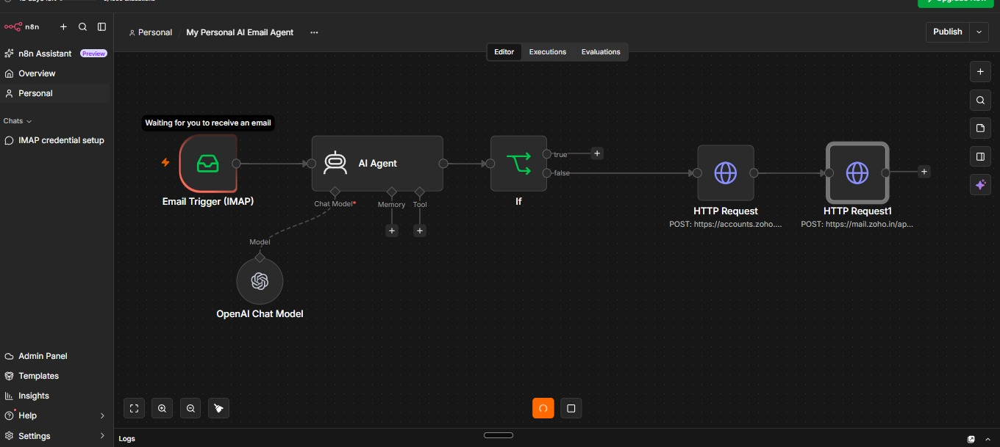
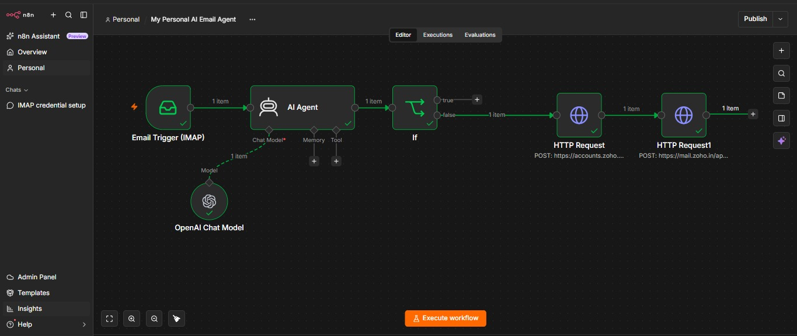
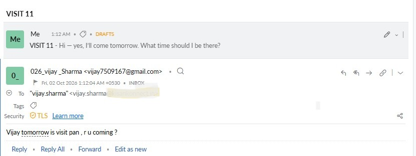

Yes Vijay 👍 Now your repository has the **complete files**:

- `Vijay_Sharma_AI_Email_Reply_Workflow.docx`
- `Vijay_Sharma_AI_Email_to_Zoho_Draft_Workflow.docx`
- `n8n-workflow.jpeg`
- `email-draft.jpeg`
- `email-example.jpeg`
- `Email reply Workflow.jpg`
- `Email reply video.mp4`

Your current README still contains the old **“Step 9 — Add the README content”** instructions. We should replace it completely.

## Final README.md

Go to **README → pencil ✏️ Edit** and **replace everything** with this:

```markdown
# 🤖 AI Email Agent

An AI-powered email automation workflow built with **n8n, OpenAI and Zoho Mail**.

The agent reads incoming emails, understands the sender's intent, decides whether a response is required, and creates a professional email draft for human review.

> **Created by Vijay Sharma**

---

## 📌 Project Overview

The goal of this project is to automate repetitive email handling while keeping a **human in control of the final response**.

Instead of automatically sending emails, the AI analyzes each incoming email and follows two paths:

- **NO_REPLY** → No action is taken
- **REPLY** → A draft response is created for review

The final email is always reviewed and manually sent by the user.

---

## 🔄 Workflow

```text
                 Incoming Email
                       │
                       ▼
              ┌─────────────────┐
              │ Email Trigger   │
              │     (IMAP)      │
              └────────┬────────┘
                       │
                       ▼
              ┌─────────────────┐
              │    AI Agent     │
              │ Understands     │
              │ Email Intent    │
              └────────┬────────┘
                       │
                       ▼
                 ┌───────────┐
                 │    IF     │
                 └─────┬─────┘
                       │
              ┌────────┴────────┐
              │                 │
           NO_REPLY           REPLY
              │                 │
              ▼                 ▼
             STOP         Refresh OAuth
                                │
                                ▼
                         Create Email Draft
                                │
                                ▼
                         Human Review
                                │
                                ▼
                          Manual Send
```

---

## 🧠 How the AI Works

The AI analyzes the email and determines whether the sender actually expects a response.

### Information-only email

Example:

```text
FYI, the server has been restarted.
```

AI result:

```text
NO_REPLY
```

No draft is created.

---

### Email requiring a response

Example:

```text
Vijay, are you coming tomorrow?
```

AI result:

```text
REPLY
Hi, yes, I'll come tomorrow.
```

The response is then saved as a draft for human review.

---

### Another example

Incoming email:

```text
Can you send me yesterday's sales report?
```

AI understands that this is a request and generates a suitable reply draft.

---

## ✨ Key Features

- 📩 Incoming email detection using IMAP
- 🤖 AI-powered email understanding
- 🧠 Intent detection
- 🚫 Ignores information-only emails
- ✍️ Generates professional email replies
- 📝 Saves replies as drafts
- 👤 Human approval before sending
- 🔐 OAuth-based API authentication
- 🧵 Reply support using the original message ID
- 🌏 Uses Asia/Kolkata (IST) for relative dates
- ⚠️ Avoids inventing facts, deadlines or commitments
- 📊 Handles large recipient lists carefully

---

## 🛠️ Technologies Used

| Technology | Purpose |
|---|---|
| n8n | Workflow automation |
| OpenAI | Email understanding and reply generation |
| Zoho Mail | Email and draft management |
| IMAP | Incoming email trigger |
| OAuth 2.0 | Secure API authentication |
| REST API | Create email drafts |
| JSON | Data exchange |

---

## 🔐 Human-in-the-Loop

One important design decision in this project is:

**The AI does not automatically send emails.**

The workflow creates a draft instead.

```text
AI generates response
        ↓
Create draft
        ↓
Human reviews
        ↓
Human edits if required
        ↓
Human sends email
```

This reduces the risk of an AI sending an incorrect or unintended response.

---

## 🧩 AI Decision Rules

The AI follows rules such as:

### Reply when:

- The sender asks a question
- The sender asks for information
- The sender asks for confirmation
- The sender asks for an action
- The sender asks whether I am available or attending
- The sender asks for an opinion or decision
- The sender asks me to review, approve or share something

### Do not reply when:

- The email is only FYI
- Information is shared for reference
- A report is sent without asking for anything
- A file is shared without a request
- An announcement does not require a response

---

## ⏰ Date Understanding

The workflow uses:

```text
Asia/Kolkata
IST
UTC+05:30
```

This is used when interpreting relative dates such as:

- today
- yesterday
- tomorrow
- this week

For example:

```text
Send me yesterday's sales report.
```

The AI understands "yesterday" using the configured timezone rather than asking an unnecessary timezone question.

---

## 📸 Screenshots

### n8n Workflow



### Email Draft



### Email Example



### Reply Workflow


---

## 🎥 Workflow Demo

A video demonstration of the workflow and execution is included in this repository.

**Video:**

[▶️ Watch AI Email Agent Demo](./Email%20reply%20video.mp4)

---

## 📚 Documentation

Detailed step-by-step documentation is available in the Word files below.

### 1. Email Reply Workflow

[📄 AI Email Reply Workflow](./Vijay_Sharma_AI_Email_Reply_Workflow.docx)

This document explains:

- Email Trigger
- AI Agent
- OpenAI Chat Model
- AI decision logic
- NO_REPLY / REPLY classification
- IF node
- Testing examples
- Final workflow checklist

### 2. Email to Draft Workflow

[📄 AI Email to Zoho Draft Workflow](./Vijay_Sharma_AI_Email_to_Zoho_Draft_Workflow.docx)

This document explains:

- OAuth authentication
- Access token generation
- Zoho Mail API
- HTTP Request nodes
- Draft creation
- Email recipient mapping
- Subject and message handling
- Reply threading
- Testing
- Troubleshooting
- Security

---

## 🔒 Security

No real credentials should be stored in this repository.

Never commit:

- Client Secret
- Refresh Token
- Password
- API Key
- OAuth credentials
- App passwords

Example placeholders:

```text
Client ID      = xxxxx_CLIENT_ID
Client Secret  = xxxxx_CLIENT_SECRET
Refresh Token  = xxxxx_REFRESH_TOKEN
```

All sensitive credentials should be stored securely inside the automation platform or a secure secret-management system.

---

## 🧪 Example Flow

```text
Email received
      ↓
AI reads email
      ↓
Is a response required?
      │
 ┌────┴────┐
 │         │
NO        YES
 │         │
 ▼         ▼
STOP    Generate reply
          ↓
       Create draft
          ↓
      Human review
          ↓
       Manual send
```

---

## 🎯 Project Objective

This project demonstrates how **AI + workflow automation + email APIs** can be combined to create a practical email assistant.

The focus is not only on generating text, but also on:

- Understanding email intent
- Avoiding unnecessary replies
- Handling real-world email variations
- Preventing invented information
- Maintaining human approval
- Creating drafts instead of automatically sending emails

---

## 👨‍💻 Author

**Vijay Sharma**

Built as a practical AI automation project to explore real-world AI agents, workflow automation and human-in-the-loop email processing.
```
